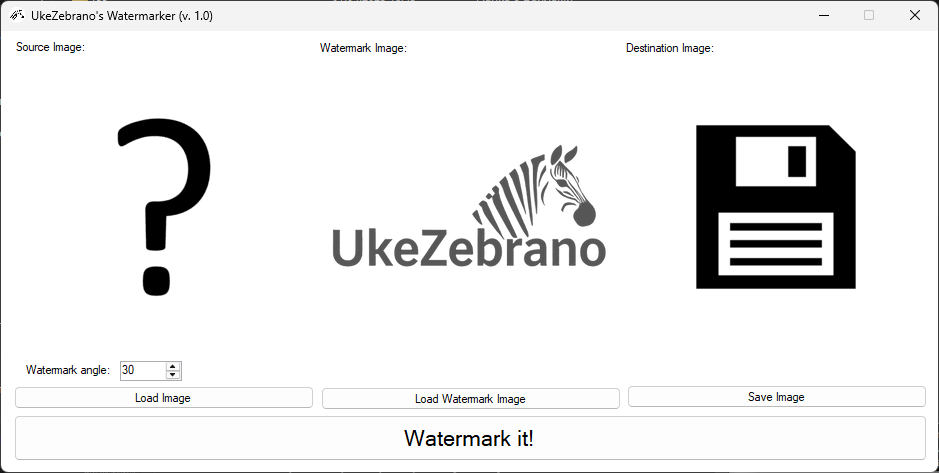

# Watermarker
The main screen of the application:

**Version 1.1 update:**
    
    - Full coverage of the image with the watermark used. The watermark image is used as a template in a checkerboard pattern.    